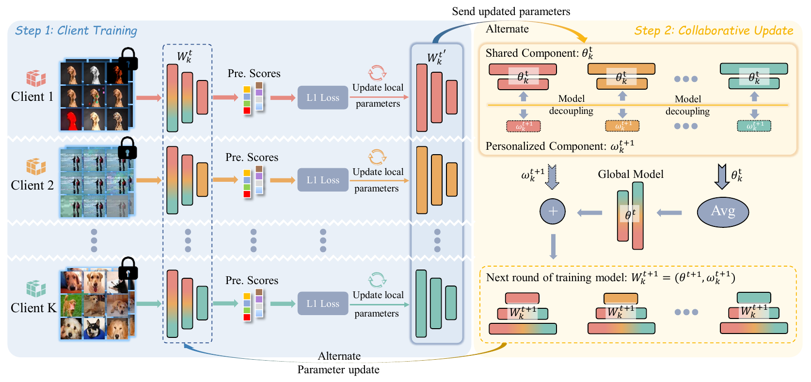

# [TCSVT] Rethinking Objective Image Quality Assessment with Federated Learning

> Shishun Tian, Yonghong Zheng,  Guanghui Yue, Weisi Lin, Patrick Le Callet,
> *TCSVT 2025*, [Paper Link](待替换)

## Abstract
Deep neural network (DNN)-based image quality assessment (IQA) methods have achieved remarkable progress in recent years. However, existing DNN-based IQA approaches still face two major challenges. First,  IQA datasets usually suffer from insufficient training samples. Second, substantial differences in quality scoring standards and scales among different datasets limit the unified training of IQA models. In this paper, we propose a novel objective IQA training framework based on federated learning (FL). To tackle the problem of insufficient labeled training samples, the proposed FL-based IQA framework conducts collaborative training by uniting samples from different datasets. Instead of simply mixing multiple datasets, we train the IQA model on each dataset individually and aggregate the results of different models. Meanwhile, considering the inconsistencies in the scoring standards and scales of different datasets, we propose a model decoupling strategy to divide the model into shared and personalized components: the former maintains global knowledge across all models, while the latter allows flexible adjustments tailored to the specific characteristics of individual datasets. Experiments on five IQA datasets show that our proposed FL-based IQA framework has improvements in accuracy and robustness on existing IQA models.

## FL-based IQA framework



## Comparison with single-dataset training

## 

## Setup Environment 

For this project, we used python 3.7. We recommend setting up a new virtual environment:

```
python -m venv ~/venv/FedIQA
source ~/venv/drgqa/bin/activate
```

In that environment, the requirements can be installed with:

```
pip install -r requirements.txt
```

All experiments were executed on an NVIDIA GeForce RTX 4090.

## Training

```
python main.py
```

## Citation

```

```

## Acknowledgements

FedIQA is based on the following open-source projects. We thank the authors for making the source code publicly available.

- [TReS](https://github.com/isalirezag/TReS)
- [hyperIQA](https://github.com/SSL92/hyperIQA)
- [PFLlib](https://github.com/TsingZ0/PFLlib?tab=readme-ov-file)